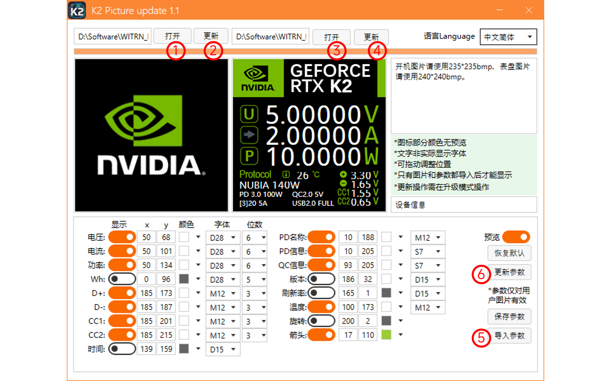
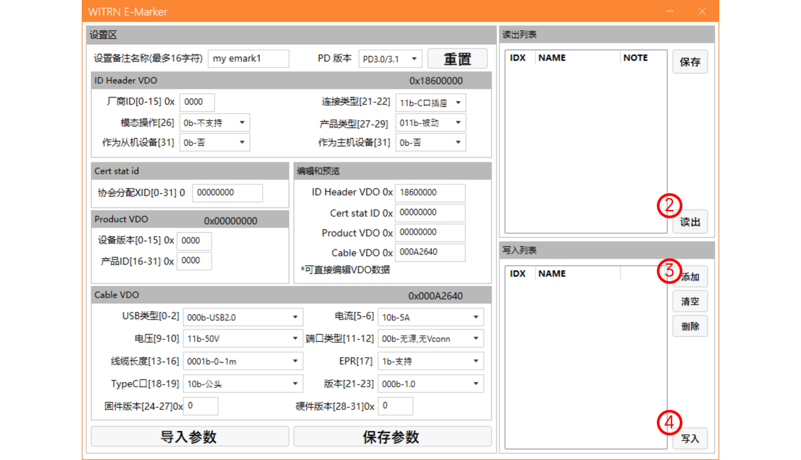

# WITRN K2快速查询手册

  

## 目录

- [K2基本介绍](#k2基本介绍)
- [开机/亮屏类](#开机亮屏类)
- [功率类](#功率类)
- [快充协议检测/诱骗类](#快充协议检测诱骗类)
- [表盘类](#表盘类)
- [E-Marker类](#E-Marker类)
- [固件类](#固件类)
- [上位机类](#上位机类)
- [线阻类](#线阻类)

## 观前须知

本快速查询手册**非官方发布**，一切内容以官方说明书为准：[WITRN K2官方说明书](https://www.witrn.com/?p=2105)。

本快速查询手册旨在为首次使用维简K2电压电流表的用户提供一些帮助，其中收录了一些常见的问题，您可以通过上方目录快速跳转到自己想要的问题大类，也可以逐个条目浏览获得相对全面的基础性知识。如果您有很丰富的基础知识，或是已经熟练使用K2，那么本手册可能无法为您提供帮助。

如果您在浏览的过程中遇到了一些无法理解的词汇，可以通过提前预设的脚注[^1]查看详意，如果没有脚注的同时您也无法理解内容，您可以通过各种方式告知我们（例如issue，QQ群等），也有可能这个部分对您来说真的没有了解的必要（非贬义），跳过即可。

如果您也要与我们共同维护WITRN K2快速查询手册，请在[Github仓库](https://github.com/JohnScotttt/WITRN-K2-Quick-Reference-Manual)下提交PR。

## K2基本介绍

### 目录
- [三个接口](#三个接口)
- [四个按钮](#四个按钮)
- [第一页](#第一页)
- [第二页](#第二页)
- [第三页](#第三页)
- [第四页](#第四页)

### 三个接口

**Type-C公头**：可以接手机或充电器插座

**Type-C母座**：可以接充电线

**HID/NTC接口**：可以接充电线实现独立供电或连接上位机[^2]（同时独立供电）或接一个温度探头（NTC）

**注意**：K2的正确电路方向是图示方向的**从左到右**或**从右到左**，上方HID母座仅给K2本体供电，与原始电路**无关**。

### 四个按钮

**`BACK`**：返回键/退出

**`-`**：向前切屏/调整/选择-，长按上电进入DFU升级模式

**`OK`**：确认/执行/保存/进入

**`+`**：向后切屏/调整/选择+，长按上电从PD取电

### 第一页

短按 **`BACK`** 锁定/解锁屏幕旋转，锁定时长按 **`BACK`** 旋转屏幕；短按 **`OK`** 查看PDO[^3]/RDO[^4]列表（如果有），长按 **`OK`** 改变屏幕刷新率。

### 第二页

短按 **`BACK`** 切换记录组别；短按 **`OK`** 保存MAX和AVG值，长按 **`OK`** 清除当前组能量/容量记录，同时清除MAX和AVG。

### 第三页

短按 **`OK`** 改变采样频率。

### 第四页

**快充**：进入快充协议检测页

**工具**：进入工具页

**方向**：选择方向锁定/解锁

**设置**：进入设置页

## 开机/亮屏类

### 目录

- [怎么开机/亮屏](#怎么开机亮屏)
- [为什么插线不亮屏](#为什么插线不亮屏)
- [为什么按闪电插线不亮屏](#为什么按闪电插线不亮屏)
- [为什么拔掉手机就黑屏](#为什么拔掉手机就黑屏)
- [为什么显示“K2 DFU”](#为什么显示k2-dfu)；

### 怎么开机/亮屏

K2左右侧的Type-C公头和母座皆可上电，可以将Type-C数据线插入母座开机/亮屏，也可以将K2的公头插入插头开机/亮屏。

**注意**：无论您使用的是哪一种类型的线材（AC线或是CC线），或者是插入插头，推荐您始终使用长按 **`+`** 上电。

**备注**：

> K2官方提供另一种开机方式：按 **`OK`** 开机。但是此开机方式存在许多限制，通常不推荐您这么做。
>
> 如果您只考虑将K2作为一个充电监视器，那么不需要做任何开机操作，将其连入原先充电电路即可；如果执行开机操作可能会导致充电功率极低、协议错误，详见[为什么接K2后充电功率很低](#为什么接K2后充电功率很低)。

### 为什么插线不亮屏

首先，检查您的数据线是否插在有电的插座上。

其次，您的充电头默认使用PD供电，没有基础的5V供电，由于K2是直通表[^5]设计，如果直接插K2且不连接手机等其他设备，则PD充电头将不会提供电压输出。

**解决方法**：K2采用电子开关的方式，长按 **`+`** 激活PD 5V供电，此时开机/亮屏。对于PD充电头， __先长按 **`+`** 后插线/头__ 和 __先插线/头后长按 **`+`**__ 是完全相同的逻辑。

### 为什么按闪电插线不亮屏

因为PD芯片只与Tpye-C中的一组CC引脚连接，Type-C充电线有两组CC引脚，有二分之一概率无法激活PD 5V。

**解决方法**：把充电线翻面再重复上电操作。

### 为什么拔掉手机就黑屏

K2为直通表[^5]设计，如果手机原先使用PD协议充电，则拔掉手机后，通讯中断，PD充电头不再供电，K2就黑屏了。

**解决方法**：参考[为什么插线不亮屏](#为什么插线不亮屏)解决方法。

### 为什么显示“K2 DFU”

上电时按着 **`-`** 了，进入了DFU模式[^6]。

**解决方法**：注意上电姿势，具体参考[怎么开机](#怎么开机亮屏)。

## 功率类

### 目录
- [为什么不插设备也有功率](#为什么不插设备也有功率)
- [为什么显示功率小于充电器标注功率](#为什么显示功率小于充电器标注功率)
- [为什么第一页右下角显示的功率和实际功率不一样](#为什么第一页右下角显示的功率和实际功率不一样)
- [为什么第一页右下角绿/灰框里的功率和我手机支持的功率不一样](#为什么第一页右下角绿灰框里的功率和我手机支持的功率不一样)
- [为什么接K2后充电功率很低](#为什么接K2后充电功率很低)

### 为什么不插设备也有功率

如果您通过数据线连接K2的母座，那么K2将统计自身的功耗，所以会显示约0.3W的功耗。

**解决方法**：通过HID供电可以抵消自身功耗；或者从公头取电，此时也不统计自身功耗。

### 为什么显示功率小于充电器标注功率

充电器标注的功率是该充电器支持的最大功率，实际功率取决于设备/手机向充电器申请的功率，也取决于充电状态，正常情况下K2显示的功率应当总小于等于充电器标注的功率，这与K2无关，取决于设备/手机厂商、充电状态。

### 为什么第一页右下角显示的功率和实际功率不一样

绿框内显示的是充电头广播的最大功率，与实际申请协议无关。

灰框内的申请功率和电压电流为无感监听（PD）或假协议推断（一些私有协议），一般是当前申请档位的最大电流电压值，实际电流电压还要受线材压降、设备/手机当前状态的影响，正常情况下K2显示的值应当总小于等于申请的值，这与K2无关，取决于设备/手机厂商、充电状态。对于私有协议，可能存在推断错误，这是K2的错误，需要等待后续升级。

### 为什么第一页右下角绿/灰框里的功率和我手机支持的功率不一样

基本原理同上一条，一般该问题存在于私有协议的推断，如不正确，需要等待后续升级。

部分协议还涉及到通讯引脚问题，如果不正确，尝试翻转充电线Type-C口重新尝试。

### 为什么接K2后充电功率很低

如果设备/手机正常激活快充且设备/手机接近满电，则为正常现象，参考[为什么显示功率小于充电器标注功率](#为什么显示功率小于充电器标注功率)。

如果设备/手机无法正常激活快充，同时功率还很低，通常是因为先让K2长按 **`+`** 连接充电线，然后又让K2连接设备/手机，此时K2单独视为一个设备，不是完全的直通模式，充电头在与K2通讯而不是设备/手机，所以产生问题。

**解决方法**：断开K2与供电端的连接，然后直接连接无需任何额外操作，待设备/手机与充电头完成正确的协议握手后即可，如果还是无法握手尝试断开所有连接后重新连接。

## 快充协议检测/诱骗类

### 目录

- [什么是快充协议](#什么是快充协议)
- [怎么测快充协议](#怎么测快充协议)
- [怎么诱骗快充协议](#怎么诱骗快充协议)
- [为什么一测快充协议就黑屏](#为什么一测快充协议就黑屏)
- [为什么协议检测/诱骗不能接手机/设备](#为什么协议检测诱骗不能接手机设备)
- [能不能通过协议诱骗强行高功率快充](#能不能通过协议诱骗强行高功率快充)
- [能不能通过协议诱骗把充电头的A协议变成手机支持的B协议](#能不能通过协议诱骗把充电头的A协议变成手机支持的B协议)
- [为什么检测出来的协议与充电头标注的不一样](#为什么检测出来的协议与充电头标注的不一样)
- [为什么第一页右下角显示的协议和手机实际协议不一样](#为什么第一页右下角显示的协议和手机实际协议不一样)
- [什么是“PD加速”](#什么是PD加速)
- [怎么屏蔽协议](#怎么屏蔽协议)

### 什么是快充协议

由于各种历史遗留问题，在高功率充电方面，各家手机/设备厂商有不同的解决方案，每一种方案就是一种协议。第三方充电头厂商为了知道手机/设备使用的哪种解决方案，就会和手机/设备通讯，确定所需要的协议，然后给手机/设备供电。各协议之间并不互通，如果充电头提供的快充协议和手机/设备支持的快充协议不匹配，则只会使用最低的5V供电。

### 怎么测快充协议

**警告：快充协议检测/诱骗的任何阶段都不可以接入设备！！！如无视该警告则有极大概率烧毁设备！！！如果您是该领域大神，清楚知道您在做什么，则无视该警告。**

使用正确的上电方式启动K2，在第四页->**快充**选项进入

里面有一项自动检测协议和若干项快充协议诱骗，选择**自动检测协议**会弹出提示

各版本下界面有所不同，V2.9及以下版本如需更改虚拟E-Marker[^7]，需要单独去**设置->虚拟EMARK**更改；V3.1及以上版本可以快速选择虚拟E-Marker；V3.4版本增加PD加速[^8]开关。

**OFF**：表示不使用虚拟Emark数据

**inbuilt emark**：表示使用K2内置默认240W（50V 5A PD3.1 EPR）虚拟Emark数据

__copied emark *NG__：表示是否使用复制的emark数据，**NG表示没复制过任何数据** （NG字符没显示表示已经复制过数据）

K2还支持通过升级软件写入多条虚拟E-Marker，同样会在该界面列出，供选择使用。

**注意**：虽然K2支持虚拟E-Marker，但是最优的检测方法还是通过充电头官方原装数据线连接K2母座，或者K2公头连接充电头时母座插入充电头官方原装数据线**并悬空**（用于充电头检测数据线的E-Marker[^7]），此时检测到的协议最为准确。自动检测协议不可以使用HID供电，当遇到特殊情况： 黑屏，无限重启的充电头或充电宝，可接HID供电测完。检测过程中，K2会**重启**，这是正常现象。

选择好虚拟E-Marker后按 **`OK`** 进入自动检测，经过多次重启后，当右上角显示END时检测结束

此时可以查看充电头支持的所有协议，如支持PD，按 **`OK`** 可以查看PDO列表。

左下角显示当前使用的E-Marker，如果是OFF则显示“快充协议检测”。

如果是V3.4及以上版本会在上方绿框内显示PD加速[^8]开关ON或者OFF。

**备注**：

> K2自动检测界面目前**不检测**部分魔改PD，只检测通用PD 
> **魔改PD类型比较多** 
> 例如OPPO已经淘汰的第二代SVOOC（魔改PPS）**不检测** 
> 目前OPPO已经全面升级为第三代SVOOC（魔改UFCS） 
> 自动检测界面不检测，可进UFCS诱骗菜单激活第三代SVOOC的UFCS魔改
>
> 小米的140W,210W,个别67W等，属于特殊MIPPS，**不检测** 
> 小米MIPPS只检测常规120W或以下小米标准MIPPS
>
> VIVO：VFC协议自动检测菜单可检测 
> 激活具体电压电流，可以单独进入VFC诱骗菜单操作
>
> 华为SCP：目前华为主打快充协议 
> 自动检测菜单可检测

### 怎么诱骗快充协议

**警告：快充协议检测/诱骗的任何阶段都不可以接入设备！！！如无视该警告则有极大概率烧毁设备！！！如果您是该领域大神，清楚知道您在做什么，则无视该警告。**

在快充界面中选择任意快充协议选项就可以检测充电头是否支持该快充协议，如支持则会进入诱骗页面，可以自由调整电压，如支持调整限制电流则也可以自由调整。

### 为什么一测快充协议就黑屏

没有使用正确的上电方式，例如使用 **`OK`** 上电，此时测任何快充协议都会黑屏。

**解决方法**：注意上电姿势，具体参考[怎么开机](#怎么开机亮屏)。

### 为什么协议检测/诱骗不能接手机/设备

**警告：快充协议检测/诱骗的任何阶段都不可以接入设备！！！如无视该警告则有极大概率烧毁设备！！！如果您是该领域大神，清楚知道您在做什么，则无视该警告。**

检测协议时如果检测到高电压协议，输出端就会携带高电压，如果接入手机或其他低压设备，则有烧毁手机/设备的风险（极大概率）。诱骗界面同理。

### 能不能通过协议诱骗强行高功率快充

**警告：快充协议检测/诱骗的任何阶段都不可以接入设备！！！如无视该警告则有极大概率烧毁设备！！！如果您是该领域大神，清楚知道您在做什么，则无视该警告。**

**不能**，未经过握手的协议无法实现正常充电，轻则进入保护，重则烧毁设备。

### 能不能通过协议诱骗把充电头的A协议变成手机支持的B协议

**警告：快充协议检测/诱骗的任何阶段都不可以接入设备！！！如无视该警告则有极大概率烧毁设备！！！如果您是该领域大神，清楚知道您在做什么，则无视该警告。**

**不能**，K2诱骗后输出端只负责输出电压电流，不负责协议转换，未经过握手的协议无法实现正常充电，轻则进入保护，重则烧毁设备。

您需要的功能名为**桥梁线**，在淘宝可以买到。

### 为什么检测出来的协议与充电头标注的不一样

如果未使用充电头官方原厂充电线连接K2，或未开启虚拟E-Marker，K2将无法检测3A以上的快充协议，此时就会出现检测出来的协议与充电头标注的不一致，同时使用该充电线对设备充电的实际可握手协议是与K2检测的一致，即无法开启快充。

**解决方法**：使用充电头官方原厂充电线或充电头可以识别的充电线。

### 为什么第一页右下角显示的协议和手机实际协议不一样

第一页右下角显示的是PD监听和假协议推断，可能会不正确，一般该问题存在于私有协议的推断，如不正确，需要等待后续升级。

部分协议还涉及到通讯引脚问题，如果不正确，尝试翻转充电线Type-C口重新尝试。

### 什么是“PD加速”

**注意**：当前有关“PD加速”的官方定义仍不完备，本手册的解释仅基于一些测试结果。

PD加速开关是V3.4及以上版本的一个开关选项，V3.4以下版本默认开启，官方定义为：

> “PD加速”功能，检测常规充电头请关闭 
> 部分苹果PD充电头请开启（PD加速，部分苹果头才需开启） 
> “PD加速” 读取部分苹果PD充电头序列号开启

通常PD加速只用于苹果头的自动检测协议和苹果PD电源读码，实际测试过程中有部分非苹果充电头也会受干扰，当前版本下如果协议检测存在问题，尝试开启或关闭PD加速后重试。

### 怎么屏蔽协议

从V3.1开始，K2支持D+D-屏蔽，可屏蔽UFCS，SCP等走D+D-的协议，优先PPS。

通过第四页->设置->**屏蔽D+D-开关**进入，选择开启后返回就会屏蔽D+D-，即刻生效。

## 表盘类

### 目录

- [怎么自定义表盘和开机图](#怎么自定义表盘和开机图)
- [为什么上传了表盘却没有显示](#为什么上传了表盘却没有显示)
- [为什么表盘页显示“无主题参数”](#为什么表盘页显示无主题参数)
- [为什么表盘页显示“无主题图”](#为什么表盘页显示无主题图)

### 怎么自定义表盘和开机图

**注意**：[K2固件](https://www.witrn.com/?p=2105)请升级到V2.9或以上版本，只支持电脑WINDOWS系统运行（使用前**先解压**）

在[官网](https://www.witrn.com/?p=2615)下载[表盘编辑软件(直链)](https://www.witrn.com/witrn/K2/K2Picture_1.1.zip)，**解压**后运行K2Picture.exe（只支持电脑WINDOWS系统运行，软件运行提示缺少.net core运行库的，联网安装运行库即可，安装X86版本，兼容x64）

**注意**：每次准备更新时都需要将K2进入DFU模式[^6]，每次更新结束后都会退出DFU模式，关于DFU模式详见[怎么进入DFU模式](#怎么进入dfu模式5)。

如果您是从网上下载的开机图和表盘，则执行以下流程：

- 如果要上传**开机图**，则进入DFU模式，点击①打开要上传的图，点击②更新数据，等待进度条走完提示更新完毕。
- 如果要上传**表盘**，则进入DFU模式，点击③打开要上传的图，点击④更新数据，等待进度条走完提示更新完毕，然后进入DFU模式，点击⑤导入表盘参数，点击⑥更新参数，等待进度条走完提示更新完毕。只有图片和参数都导入后才能显示。

**注意**：表盘如果要生效需要上传**图片**和**参数**，缺一不可。

如果您是自己创作开机图和表盘，开机图片请使用235x235bmp，表盘图片请使用240x240bmp，文字大小字体非实际显示字体大小字体，文字可拖动调整位置，图标部分颜色无预览，参数调整完后记得点击保存参数生成参数文件方便下次调用。

### 为什么上传了表盘却没有显示

表盘功能默认关闭：如果需要使用此功能，需要在设置菜单开启

**解决方法**：第四页->设置->主题屏开关，打开即可。

### 为什么表盘页显示“无主题参数”

缺少表盘参数。

**解决方法**：通过表盘编辑软件上传参数，详见[怎么自定义表盘和开机图](#怎么自定义表盘和开机图)

### 为什么表盘页显示“无主题图”

缺少表盘图片。

**解决方法**：通过表盘编辑软件上传表盘图片，详见[怎么自定义表盘和开机图](#怎么自定义表盘和开机图)

## E-Marker类

### 目录

- [E-Marker是什么/干什么](#E-Marker是什么干什么)
- [“inbuilt emark”是什么](#inbuilt-emark是什么)
- [怎么读取E-Marker](#怎么读取E-Marker)
- [怎么导出/导入E-Marker](#怎么导出导入E-Marker)

### E-Marker是什么/干什么

E-Marker是嵌在 USB Type-C 线缆中的一个芯片，相当于线材的“电子身份证”，它会向主机和设备声明这根线的能力（如是否支持高速传输、最大电压电流、长度等），从而保证PD快充和数据传输时的安全与兼容；没有 E-Marker 的线不能支持大于3A电流和高速模式。

各个厂商有自己的E-Marker芯片信息，有些快充协议依赖于E-Marker认证，没有E-Marker或E-Marker不符合也无法握手协议。

K2内置虚拟E-Marker，可以一定程度上模拟E-Marker的能力，但是不能完全替代E-Marker，因为部分厂商的E-Marker有加密，虚拟E-Marker无法模拟，而有些充电头读取E-Marker的能力超过了K2的模拟能力，也无法识别。

### “inbuilt emark”是什么

K2内置默认240W（50V 5A PD3.1 EPR）虚拟Emark数据

### 怎么读取E-Marker

K2有读取和复制E-Marker的能力。通过HID供电，选择第四页->工具->**E-Marker**进入

数据线插入Type-C母座就可以读取E-Marker信息。E-Marker信息不代表数据线实际能力，就像E-Marker可以模拟。

在此页面下长按 **`OK`** 可以复制当前的E-marker信息，复制的E-Marker保存在“copied emark”内。K2只能同时保存一条复制的E-Marker，如果想要K2携带多条E-marker，详见[怎么导入/导出E-Marker](#怎么导入导出E-Marker)。

### 怎么导出/导入E-Marker

K2复制的E-Marker可以通过连接电脑导出。

在[官网](https://www.witrn.com/?p=2339)下载[WITRNPC固件升级软件V2.6(直链)](https://www.witrn.com/witrn/PC/WITRN_USBMeterUP_V26.rar)，**解压**后运行MeterUP.exe（只支持电脑WINDOWS系统运行，运行软件提示没.net的，会自动联网下载X86运行库（32/64位系统通用））

点击①“虚拟EMARK设置”进入

将K2进入DFU模式[^6]，点击②可以读出K2复制的E-Marker以及原先写入K2的E-Marker。

如果您需要向K2写入E-Marker，可以点击③选择保存的E-Marker参数，如要写入多条则添加多次，点击④向K2覆盖写入E-Marker列表，原先保存在K2内的E-Marker将被覆盖。

如果您要自定义E-Marker信息，可以在左侧编辑E-Marker信息或导入已有的E-Marker修改，修改后可以点击“保存参数”保存成E-Marker参数。

## 固件类

### 目录

- [怎么进入DFU模式](#怎么进入DFU模式6)
- [怎么升级](#怎么升级)

### 怎么进入DFU模式[^6]

数据线一端连接电脑，K2长按 **`-`** 的同时数据线另一端插入HID，进入DFU模式。只有连接电脑才有烧录固件能力，如果只连接充电头则没用。

### 怎么升级

在[官网](https://www.witrn.com/?p=2339)下载[WITRNPC固件升级软件V2.6(直链)](https://www.witrn.com/witrn/PC/WITRN_USBMeterUP_V26.rar)，**解压**后运行MeterUP.exe（只支持电脑WINDOWS系统运行，运行软件提示没.net的，会自动联网下载X86运行库（32/64位系统通用））

将K2进入DFU模式，点击①选择要升级（或降级）的固件，点击②将固件写入到K2中，等待进度条走完提示更新完毕。

## 上位机类

### 目录

- [如何连接上位机](#如何连接上位机)

### 如何连接上位机

在[官网](https://www.witrn.com/?p=873)下载[WITRN上位机曲线软件V3.1(直链)](https://www.witrn.com/witrn/PC/Meter_soft_V3.1.rar)，**解压**后运行WITRN.exe（只支持电脑WINDOWS系统运行，软件运行提示缺少.net core运行库的，联网安装运行库即可，安装X86版本，兼容x64）

直接使用数据线连接电脑和HID就可以使用上位机。由于上位机功能过多，目前仅提供[官方说明](https://www.witrn.com/?p=873)供参考。

## 线阻类

### 目录

- [怎么测线阻](#怎么测线阻)

### 怎么测线阻

您需要购买线阻套装才能测数据线内阻，在维简淘宝店可以买到。

通过HID供电，通过第四页->工具->**线阻**进入

通过如下图的方式连接各个部件，就可以测量数据线内阻

**警告：测量时水泥电阻高温，切勿直接触摸，线阻测量完毕后，请立即断开负载！！！**

**参考指标：**

表示参考长度下的线阻参考数据 
G：优秀 
A： 可以 
M：一般 
P： 扔了

参考指标提供0.3米，1米，1.5米，2米4种长度数据。

**参考电流：**

表示当前数据线内阻可通过电流参考，并非实际可承载电流上限，仅供参考。

**备注**：

> USB-A/C1口均可进行5V电源供电 
> C2：连接C口形式的USB测试仪 
> A2：连接A口形式的USB测试仪 
> GL001隔离小板C2/A2隔离通讯，仅供电

[^1]: 例如这样
[^2]: 指可以将K2的实时数据传输到电脑的方法，详见[如何连接上位机](#如何连接上位机)
[^3]: 电源数据对象(Power Delivery Objects)，用于公开源端口的电源能力或接收器的电源要求
[^4]: 接收端口用来协商合同的请求数据对象(Request Data Objects)
[^5]: 可以简单理解为电压表，默认不干扰原先的电路，直通的意思是母座和公头直接连通
[^6]: 固件升级模式(Device Firmware Upgrade)，也可以叫作固件烧录模式
[^7]: 详见[E-Marker是什么/干什么](#E-Marker是什么干什么)
[^8]: 详见[什么是“PD加速”](#什么是PD加速)
